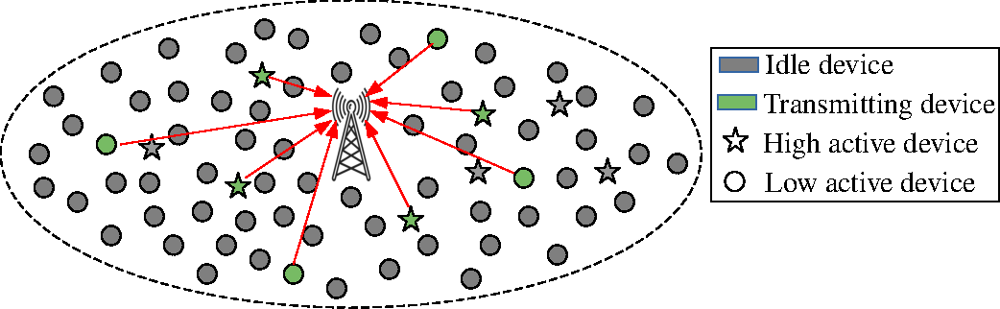
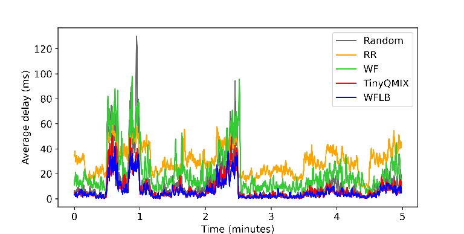

# TinyQMIX

This repository is the implementation of "TinyQMIX", which is a cooperative MADRL policy for channel selection in mMTC networks.

    
    
<strong>Figure 1.</strong> mMTC devices uplink transmission model

We compare it with different static, tabular Q-learning, and deep Q-learning policies for distributed channel selection methods.

    
    
<strong>Figure 2.</strong> Moving average of the access delay. Traffic dynamic changes every 10 seconds

Over 5 minutes of testing trace, TinyQMIX has the lowest delay, approaching the empirical lower-bound WFLB.

This is the repository for the paper "TinyQMIX: Distributed Access Control for mMTC via Multi-agent Reinforcement Learning" - presented at VTC Fall 2022.

Contact: lethanh@nii.ac.jp